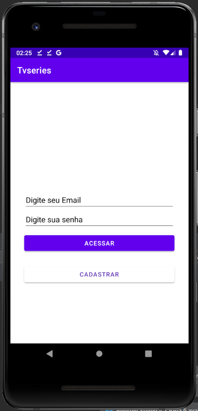
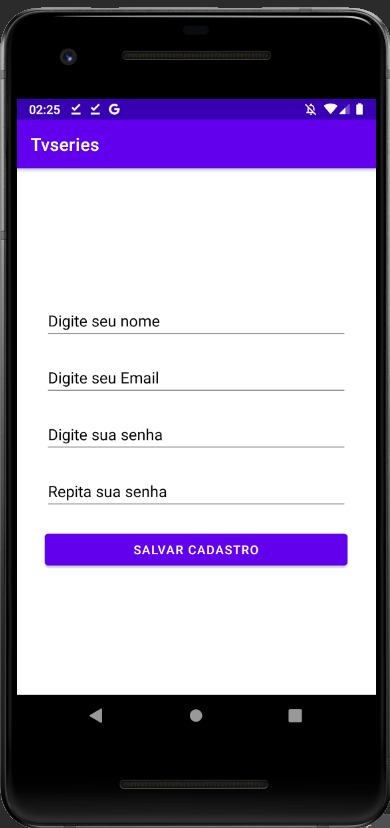
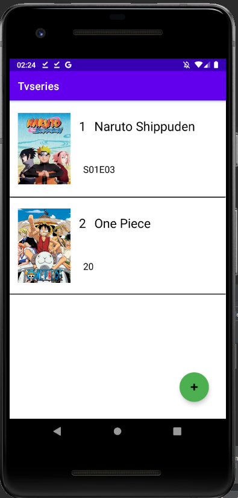
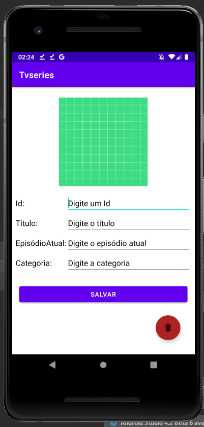
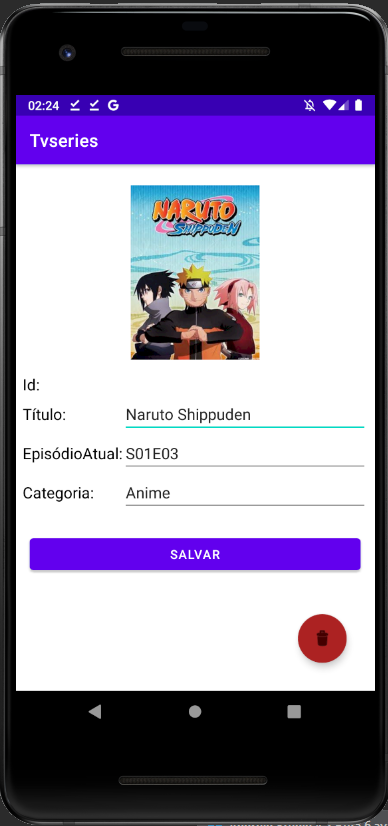

# Tvseries

CRUD utilizando Firebase FireStore, Storage e Auth

Chegou a hora de avaliar os conhecimentos adquiridos na disciplina!

Deveimplementar uma aplicação android a sua escolha e que atenda aos seguintes requisitos:

Deve ser escrito em Kotlin.
Deve conter dados armazenados no serviço Firebase Firestore.
Deve conter interfaces para listar, cadastrar, exibir, atualizar e excluir os dados.
Deve conter sincronização de dados em tempo real.
Deve solicitar ao usuário que se cadastre utilizando o recurso de autenticação com email e senha do Firebase Authentication.
Deve permitir que apenas usuário com credenciais válidas, acessem o aplicativo.
Seguem alguns exemplos de aplicações que podem atender aos requisitos:

Complemente o app implementado em TPs anteriores.
Um gerenciador de tarefas ou lista de compras compartilhado.
Um mensageiro.
Antes de fazer sua entrega, reúna todos os arquivos relativos ao seu TP em um único arquivo no formato .zip. Utilize seu próprio nome para nomear o arquivo, identificando também o teste correspondente, como no exemplo: Nome_sobrenome_DR3_TP3.zip.
